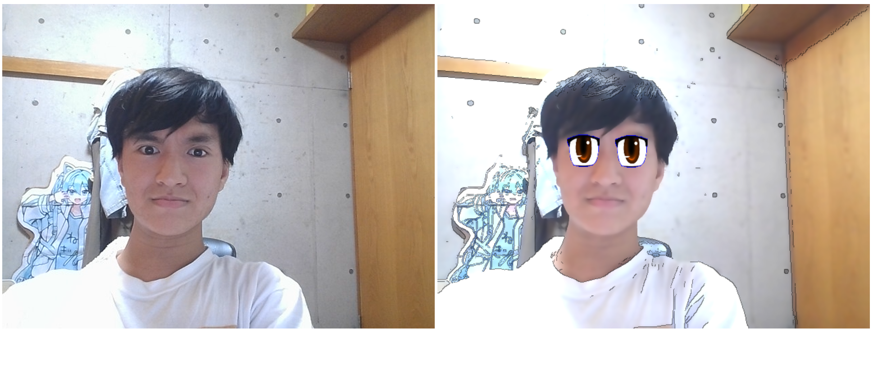

# Anime Funny

そのプログラムはとてもシンプルで、HTMLで作られたものです。

Javascriptを使って、XMLのデータセットを読んで、カメラを通して顔に「アニメの目」を付けることができます。

ぜひ試してみてください

This program is very simple and built with HTML. 
It uses JavaScript to read an XML dataset, allowing you to add "anime eyes" to your face via your camera.

## Preview

## Demo
Check it out here: https://sir-angus-mac.github.io/anime-funny/
